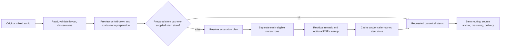
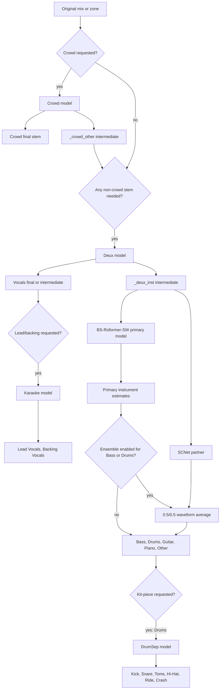
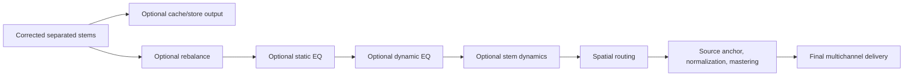

# Separation engine: high-level design

## Purpose and scope

The separation engine turns an input mix into named stereo float32 stems for the stem-upmix pipeline. It starts at source ingestion and ends when the requested stem set is ready for optional cache/store publication and for the later routing and mastering stages.

This document describes current production behavior in `packages/core`. It does not specify spatial routing, source anchoring, mastering, or delivery encoding; those consume the prepared stem set after this engine's boundary.

## System context

`StemUpmixPipeline` is the public file-oriented façade. Its separation half delegates to a coordinator that resolves a model tree, separates every eligible source zone, applies separation-local correction, and returns canonical stem arrays. The engine is deliberately offline and file-backed at stage boundaries: models can be large, and downstream model stages need selected parent stems as WAV inputs.

## Inputs, outputs, and invariants

The input is an audio file plus `UpmixConfig`. The configuration controls requested stems, delivery sample rate, optional preview, silence skipping, cache/store locations, inference tuning, and the three separation-local quality switches: primary remask, drum remask, and vocal/instrumental DSP cleanup.

The separation result contains:

- `all_stems`: `{canonical_stem or canonical_stem@zone: (frames, 2) float32}`
- the resolved plan, input/output formats, and sample rates
- center/LFE passthrough audio and source zones needed only by later routing
- a summary of requested canonical stem names

All model-stage audio is stereo at the separation rate. Mono input and single-channel model output are duplicated to stereo. Temporary peak normalization before model inference is reversed before stem write, preserving the source level domain. A requested stem must be nonempty at completion, or the run fails rather than producing a silent ambiguous result.

## Processing architecture

### Ingest and spatial preparation

`AudioReader` loads the source as float32 and detects or validates input layout. A preview slices that in-memory audio before separation. When a multichannel input is being delivered as stereo, it is first folded with the standard downmix coefficients and is thereafter treated as one front zone.

Otherwise, mono/stereo has one `front` zone. Multichannel input is split into available left/right pairs: `front`, `surround`, `back`, `height_front`, and `height_back`. Center and LFE bypass separation and remain passthrough channels for later routing. Each non-front zone is separated independently and its output is named, for example, `Drums@surround`, so the router preserves native spatial origin.

The separation rate is the output rate. It normally equals source rate; ADM defaults to 48 kHz. The model engine loads and resamples each stage input to that working rate.

### Declarative model plan

The caller supplies desired canonical names, not model choices. The plan resolver expands hierarchical requests into the smallest ordered model tree. For example, `Kick` requires an instrumental parent and a `Drums` intermediate, but does not return the parent `Drums` as a final output.

The optional crowd model is first and runs only for `Crowd`. The Deux model then produces the authoritative `Vocals` estimate and the `_deux_inst` residual. The primary model operates only on that residual and supplies instrument stems. This prevents the primary model's residual `Vocals` output from overwriting the authoritative Deux vocal. Drum-piece and vocal-part requests add one descendant stage each.

The optional fixed ensemble runs BS-Roformer-SW and SCNet on the same `_deux_inst` parent, then averages only Bass and/or Drums sample by sample. All other primary outputs remain BS-Roformer-SW outputs. An intermediate Drums stem is also fused before DrumSep when kit pieces are requested.

### Model execution and post-inference correction

Each plan stage uses a persistent `StemSeparator` for its checkpoint and sample rate. Checkpoints are looked up in the in-core registry, downloaded and integrity-checked when required, then loaded lazily. Torch selects CUDA, MPS, CoreML, or CPU where available; the registered SCNet checkpoint selects its bounded MLX worker on supported Apple Silicon hosts. Model outputs are written as float WAVs, parsed into canonical names, then either retained as arrays or kept on disk only when another stage needs them.

Primary and DrumSep stages are remasked by default. Rather than recreating every child from the parent spectrum, the engine distributes only the unclaimed parent residual over the model's child estimates. The corrected children therefore reconstruct the parent within STFT reconstruction error while retaining the model's original waveform wherever it already made an estimate. The primary correction precedes DrumSep, so a retained `Drums` intermediate is corrected before it becomes the kit model's parent.

The optional `stem_bleed_reduction` cleanup operates only on the Deux `Vocals`/`_deux_inst` pair. A fixed Rust DSP processor transfers reliable coherent leakage between those two estimates and returns a complementary pair that sums to the retained parent. It is disabled by default pending broader licensed-corpus and listening evidence.

### Optional work avoidance and persistence

Before inference, a caller-owned prepared-stem directory can replace the entire separation result. Otherwise the engine checks a versioned cache whose identity includes source identity, plan/inference identity, working rate, preview/silence settings, and quality-affecting options. The cache retains all no-extra-inference outputs and filters to requested names only before routing. Preview runs are never written to cache.

Silence skip is enabled by default. It detects long near-silent gaps per zone, separates only padded active spans, and inserts each output into a full-length zero-filled stem with linear edge fades. A fully silent zone never enters model inference.

Intermediate stage files are stabilized outside a separator's temporary directory before model eviction. Stage completion can be checkpointed under the stem cache directory; a retry with the same identity restores only finished stages. WAV cache/store outputs and streamed SCNet outputs are published atomically, so a consumer does not see a partially written stem.

## Boundary with stem shaping and delivery

After separation returns, `StemUpmixPipeline.process_file` may apply, in this order, per-stem rebalance, EQ, dynamic EQ, and dynamics before routing stems to a speaker bed. These are post-separation mix treatments, not changes to stored/cached separation estimates. `prepare_stems` stops before them and therefore produces only the corrected separation set.

## Quality and operational policy

The separation engine is not a real-time service. Model quality changes, including model swaps, ensembles, remasking, and debleed processing, are gated by the evaluation harness. It reports SDR, fullness, and bleedless together, both per stem and per regression category; a synthetic corpus is a functional check, not a music-quality claim. The remask and cleanup reports record the current algorithm choices and their limits.

The public separation boundaries are `StemSeparator` for one model and `StemUpmixPipeline` for the staged file workflow. CLI, API, and web layers must use those public surfaces rather than control model devices, checkpoints, or inference architectures directly.
