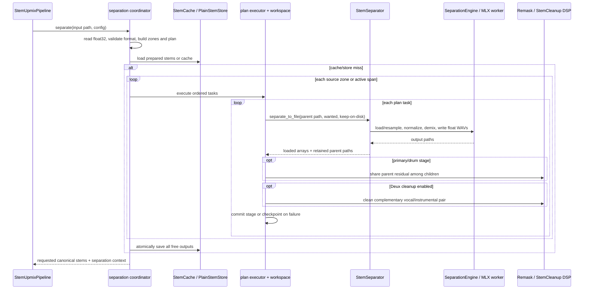
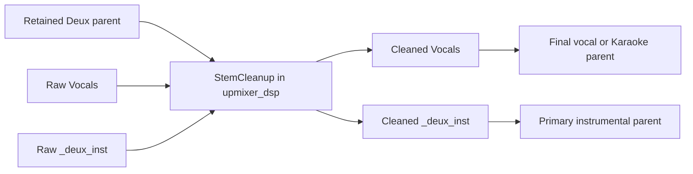

# Separation engine: low-level design

## Scope and code ownership

This is the implementation design for the current offline separation path in `packages/core/src/separation/`. The public entry points are:

| Surface | Responsibility |
| --- | --- |
| `StemSeparator` | One registered model, one file input, canonical stem outputs. |
| `StemUpmixPipeline.prepare_stems` | Separation, correction, and optional cache/store only. |
| `StemUpmixPipeline.process_file` | The above plus post-separation stem shaping, routing, and delivery. |

The delivery layers use only these public core APIs. Inference internals stay under `separation/inference`; shared fixed DSP enters through `upmixer_dsp`.

## Data contracts

| Item | Representation and rule |
| --- | --- |
| In-memory input from `AudioReader` | `(frames, channels)`, float32. |
| Model input/output | `(channels, frames)`, float32 inside inference. |
| Public stem array | `(frames, 2)`, float32, with mono duplicated. |
| Stem key | Canonical name, or `Canonical Name@zone` for multichannel zones. |
| Intermediate key | Private `_crowd_other` or `_deux_inst`; never returned as a final stem. |
| Intermediate transport | Float WAV on disk when a later stage needs it; otherwise an array. |
| Persistent output | Float WAV plus JSON metadata/manifests; written via temporary path then replace. |

The working separation rate is `out_sr`: configured output rate or source rate, except ADM-BWF defaults to 48 kHz and restricts output to 48/96 kHz. Every stage input is loaded/resampled to this rate. This makes intermediate parents and children rate-aligned for correction.

## Components and call sequence



`StemWorkspace` owns stage state. Its `loaded` mapping holds public outputs that are not later parents; `on_disk` holds retained intermediates. `commit` replaces superseded paths, `checkpoint` persists only completed boundaries, and `finish` loads final on-disk public stems, deletes intermediates, and clears a completed resume checkpoint.

## Plan resolution

`normalize_stems` accepts manifest lowercase or canonical names, validates them against the fixed vocabulary, and preserves first-requested order. `resolve_separation_plan` converts that request into `SeparationTask` values. The task resolver is the only component that chooses production models.

| Stage | Runs when | Input source | Outputs used by the plan |
| --- | --- | --- | --- |
| Crowd Mel-Band Roformer | `Crowd` requested | `original` | `Crowd`, `_crowd_other` |
| Deux Mel-Band Roformer | any primary, drum-piece, or vocal-part output is needed | `_crowd_other` or `original` | `Vocals`, `_deux_inst` |
| BS-Roformer-SW primary | an instrument or drum-piece output is needed | `_deux_inst` | Bass, Drums, Guitar, Piano, Other |
| SCNet partner | ensemble enabled and Bass/Drums are needed, including intermediate Drums for kit pieces | `_deux_inst` | only selected Bass and/or Drums, then fused |
| MDX23C DrumSep | any kit piece is requested | `Drums` | Kick, Snare, Toms, Hi-Hat, Ride, Crash |
| Karaoke Mel-Band Roformer | Lead or Backing Vocals requested | `Vocals` | Lead Vocals, Backing Vocals |

Parents needed by a later task are kept as WAVs. A parent that is only an intermediate is deleted after `finish`. Public model outputs available at no extra inference cost are cached; the coordinator filters final `all_stems` to `plan.requested_stems` after cache/save, so internal parents and unsolicited model outputs cannot reach routing.

The primary task declares only instrumental output names even though the model can emit a vocal output. Its input is the Deux instrumental residual, so this prevents an invalid residual vocal from colliding with Deux's authoritative `Vocals` key.

## Source preparation and zone execution

1. `AudioReader.read(dtype="float32")` reads the full file. The coordinator detects layout from channel count unless an exact matching override is supplied.
2. Preview mode slices the input before zone selection. If a multichannel source is rendered as stereo, it is folded down first and becomes front stereo.
3. Mono/stereo produces one `front` pair. Multichannel audio produces all present FL/FR, SL/SR, BL/BR, TFL/TFR, and TBL/TBR pairs. C and LFE bypass separation.
4. A direct unsliced stereo source may be handed to the first model as the original file. Prepared zone arrays and every later parent are rendered to temporary float WAVs.
5. One plan executes per zone. Multichannel results are suffixed with `@zone`; a single-zone result is not.

When `stem_silence_skip` is true, `find_active_spans` examines 20 ms peak windows with 10 ms hops. It ignores silence at or below the configured threshold, merges gaps shorter than the configured duration, pads active spans, and expands short active spans to five seconds where possible. The executor skips an entirely silent zone; otherwise it separates each active span, maps its offset to the separation rate, and writes it into a zero stem with configured linear fades at boundaries.

## Model loading, input normalization, and backend choice

`StemSeparator` selects a backend without importing optional inference packages at module import time:

- Torch selects CUDA (including ROCm) first, then MPS; ONNX providers can expose CUDA/CoreML; otherwise CPU is selected.
- The registered SCNet XL checkpoint uses MLX on supported Apple Silicon with `mlx` and `mlx_spectro`; it deliberately falls back from MPS to CPU when MLX is unavailable.
- Batch default is conservative per backend. CPU also derives bounded segment and outer-chunk defaults from visible memory. CPU/MLX model cache capacity defaults to one separator in `StemUpmixPipeline`.

The model registry maps checkpoint filename to architecture, bundled YAML configuration, download location, optional chunk sweet spot, and available integrity information. Download is to a temporary file followed by integrity validation and atomic replacement. Loader instances are lazy and persist for the pipeline lifetime; `close()` unloads the model/worker, empties device cache, and deletes its persistent temporary output directory.

Before demix, `audio_io.load_audio` uses librosa to load/resample and duplicate mono. `normalize` scales down only peaks above 0.9. Output stems are divided by that scale before float-WAV write, preserving source-level audio instead of publishing model-normalized audio.

OOM handling retries the same operation with less memory pressure: halve batch size first; on CPU, then reduce segment size down to 64 frames; then reduce long-file duration down to 60 seconds. Overlap, TTA, and pitch shift are quality choices and are not changed by this retry ladder. If no safe retry remains, the model/worker is released and the original failure escapes.

## Demix algorithms

The engine dispatches by registry architecture:

| Architecture | Chunk domain and reconstruction |
| --- | --- |
| BS-Roformer / Mel-Band Roformer | STFT-frame chunks with Hamming-window weighted overlap-add. Roformer uses overlap 2 by default and batch 1 except on CUDA. Short clips are padded to one full chunk. |
| TFC-TDF v3 / DrumSep | Frame chunks with weighted overlap-add; default overlap is 8. |
| SCNet | Sample-domain chunks with reflect padding where sufficient context exists, a ten-percent edge fade, and weighted overlap-add. |

Long files can be split into outer windows. Each window overlaps by a one-second linear crossfade; overlapping outputs are weighted and summed. Optional pitch-register rescue resamples by a bounded rational ratio before inference and inversely resamples/matches each stem afterward. Optional TTA runs original, polarity-inverted, and L/R-swapped variants, restores each variant transform, and averages them.

SCNet normally takes its bounded streaming path when TTA, pitch shift, and outer chunking are off. A one-model-chunk ring buffer emits only selected stems once their overlap contribution is final. `AtomicWavWriter` publishes a stem only after successful completion. The MLX implementation can use a persistent spawned worker to own MLX and checkpoint state; it has bounded allocator/cache behavior and is isolated from callers that can spawn it.

## Ensemble

The primary ensemble is fixed, not a generic ensemble framework:

1. BS-Roformer-SW separates `_deux_inst` normally.
2. Primary on-disk parents are stabilized because acquiring SCNet may evict the primary separator on constrained memory systems.
3. SCNet separates the same parent for only selected `Bass`/`Drums` names.
4. Each selected pair must have equal shape, numeric dtype, and finite values. The fused waveform is `0.5 * primary + 0.5 * partner` in float32.
5. The fused array replaces only that primary output; a retained fused Drums WAV becomes the DrumSep parent. Partner temporary outputs are discarded.

Residual remasking occurs after this fusion, exactly once for the primary stage, so its conservation correction covers the final ensemble output.

## Parent-residual remask

`share_parent_residual(parent, children, sample_rate)` is used for primary and DrumSep when their default-on switch is enabled. Inputs are trimmed to their shared shortest length. With model child estimates `c_i`, it computes:

```text
r = parent - Sum(c_i)
m_i = abs(STFT(c_i)) / Sum_j(abs(STFT(c_j)))
output_i = c_i + ISTFT(m_i * STFT(r))
```

The implementation uses a 2048-point Hann STFT with 512-sample hop, float64 working DSP, 524,288-sample blocks, and crossfaded block overlap. A near-silent denominator is split equally among children. The public helper also supports exponent `alpha`, but production calls its fixed `1.0` default.

This is intentionally not full soft-mask reprojection. Full reprojection would replace each model waveform with a magnitude-ratio reconstruction of the parent. Evaluation showed that loss of the model waveform costs quality; residual sharing retains it while making children reconstruct their parent to within STFT reconstruction error. The primary pass rewrites the stored `Drums` intermediate first, allowing the DrumSep pass to compose with it.

## Complementary vocal/instrumental cleanup

When `stem_bleed_reduction` is enabled, the executor asks the Deux separator to retain its exact resampled, restored-level parent. Immediately after Deux outputs are available and before `_deux_inst` feeds the primary model, `apply_stem_cleanup` processes the ordered pair:



Python validates equal-length mono/stereo input, promotes to stereo float64, and feeds the Rust processor in 65,536-frame blocks. The fixed policy admits only finite, energetic, coherent, clearly dominant leakage transfers and caps the transfer. Its parameters are relative energy floor `1e-8`, leakage floor `0.05`, coherence floor `0.8`, dominance ratio `4.0`, and transfer cap `0.25`. After explicit processor flush, Python removes processor latency and returns the original compatible dtype. The processor final remainder split keeps the cleaned pair complementary to its parent.

This pass is default-off. It is a bounded correction for a specific two-child boundary, not a general per-stem debleed facility.

## Cache, imported/exported stems, and resume

`stem_input_dir` has priority: `PlainStemStore` loads its `stems.json` and float WAVs, bypassing inference and the keyed cache. `stem_output_dir` writes the produced separation set into that caller-owned directory. Both retain zone names in filenames by replacing `@` with `__`.

`StemCache` uses a SHA-256-derived key over source identity, inference plan identity, separation rate, preview state, silence settings, and engine version. A stable caller `stem_cache_key` replaces path/mtime identity and uses source size as a guard. The cache stores all free model outputs and metadata, but preview results are never saved. A legacy request-specific cache entry remains readable for compatibility.

If a run has both `stem_cache_dir` and a non-preview cache identity, `ResumeStore` checkpoints the completed stage index and retained paths on a failure. The retry key matches cache identity and is additionally scoped per zone and per silence span. This prevents a completed stage from being replayed into a plan or input that would produce different audio.

## Final stem shaping boundary

`prepare_stems` ends after the filtered corrected separation set and optional cache/store output. It does not apply mix treatments. `process_file` applies these optional treatments to its in-memory `all_stems` before routing:

1. `StemRebalancer`: configured canonical-stem dB gains with a 10 ms attack ramp; no ceiling is imposed here.
2. `StemEQ`: fixed/preset or validated per-stem filters through shared DSP.
3. `StemDynamicEq`: validated per-stem dynamic-EQ settings through shared DSP.
4. `StemDynamics`: constrained linked downward compression through shared DSP.

Each lookup strips an `@zone` suffix so one setting affects every spatial zone of a stem. These operations are later mix shaping, not cache-keyed separation corrections; saved prepared stems remain model outputs plus enabled remask/cleanup.

## Error handling and completion conditions

- Invalid stem vocabulary, unmatched input-layout override, unsupported ADM rate/subtype, invalid tuning values, or no output stems fail early.
- A missing intermediate parent raises a stage-numbered error listing retained stems.
- Unrecognized output tags, unreadable output WAVs, and model outputs outside a task declared `wanted` set are discarded; an empty final result still fails.
- Non-finite or shape-mismatched ensemble inputs fail before fusion.
- Failed stage outputs are not committed as complete. Non-checkpoint intermediates are removed; checkpoint-owned files remain only for a valid resume.
- The top-level pipeline releases loaded separators on `close()` or context-manager exit.

## Verification and quality gates

Focused tests cover plan closure, intermediate materialization, cache identity and I/O, silence-span stitching, level-domain restoration, model registry smoke paths, OOM tuning, ensemble fusion, remask conservation/composition, and cleanup complementarity. The quality contract is documented in [the evaluation harness](evaluation_harness.md): any model, ensemble, phase, remask, or debleed quality change reports SDR, fullness, and bleedless together for every stem and category. The primary and drum remask decisions are backed by their corresponding reports in `docs/reports/`; the cleanup default-off policy is backed by `docs/reports/stem_dsp_cleanup.md`.
